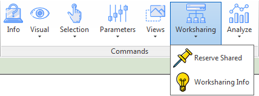

# DKTools
DKTools is an C# add-in for Revit enabling execution of Python scripts.   
Extension provide framework alowing Python scripts registration in form of buttons on the Revit ribbon.  
Add-in also contains Dockable Panel simplifing edition of parameter values.  
Several Python scripts are already implemented up and running.  
Including: view manipulation, managing element selection, anotations, element host verification, worksharing control.
Implemented Windows Forms GUI can be used as an output console for any new Python script command development. 

## [Wiki (link)](https://github.com/krzemdamian/DKTools/wiki)
Go to wiki pages for more information on:
* plugin installation
* programming technologies used during development
* how to use application as script framework
* available command descriptions

## Origin
The idea for this plug in derived from Dynamo which is visual programming environment for Revit.
In Dynamo it is possible to create custom nodes which execute actions written in python.
Unfortunately, it's not as convenient as Revit commands.
Luckily it's possible to run IronPython scripts directly in C# code.
This mechanism is used in DKTools so that python scripts are invoked in Revit through script engine.
All Revit API objects used by add-in can be passed to python scripts.
